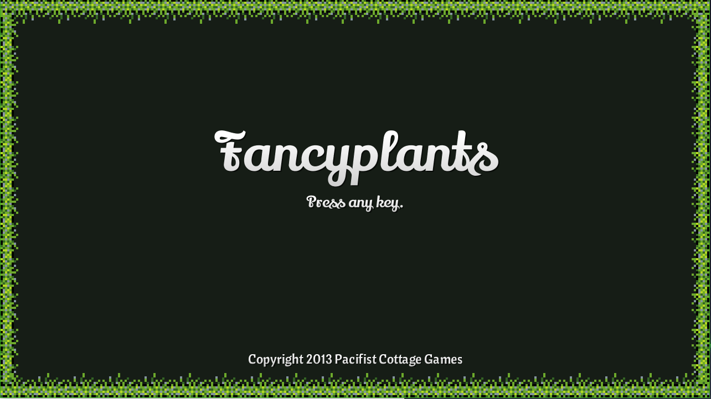

# Fancy Plants (2013)

This is a backup/dump of a sort-of-crappy game I made in 2013 as one of those "make a game in a week" kinds of things. A very short puzzle game, where you use items to finish levels (think Toki Tori, Lolo, etc.). Assuming you have even minimal problem-solving skills, you can probably finish the game in 10-15 minutes.

## Download

You can download an executable JAR [here](https://github.com/gargrave/fancy-plants/releases). It _should_ work, assuming you have Java installed, but no promises--I really haven't touched Java or LibGDX in ~5 years at this point, so I don't have much knowledge of the ecosystem anymore.

## Overview

Just a few quick points:

- I made it with [LibGDX](https://github.com/libgdx/libgdx), and it's really the only complete game I have ever made in Java.
- I didn't use any version control, so there is no actual history here--just a single big "code dump" commit.
- Looking at the code now, I committed countless formatting sins--I was working very fast, and it was quite some time ago, so don't hold it against me.
- _All_ of the assets are in the repo--everything you need to build/tweak/etc. is here.

The multi-package directory structure is just the way GDX sets up its projects (at least it was back then). I didn't actually build for Android or HTML, so don't get excited about those. A quick tour:

- The main src root is at `./FancyPlants/src/com/pacifistcottage/fancyplants`.
- The assets can be found in `./FancyPlants-android/assets`.

## Licensing

I would argue that there is nothing of real value here, but consider it public domain if you want to mess with it. Do your worst. If you end up using it or doing anything with it (god help you), give me a shout, as I would love to see it.

- The horrific sprites and sounds were all made by me, so do what you want with them. No holds barred.
- The only exception is the fonts. They came from various free-to-use font sites, but they are not my creations, so I cannot grant any usage licensing for those.
